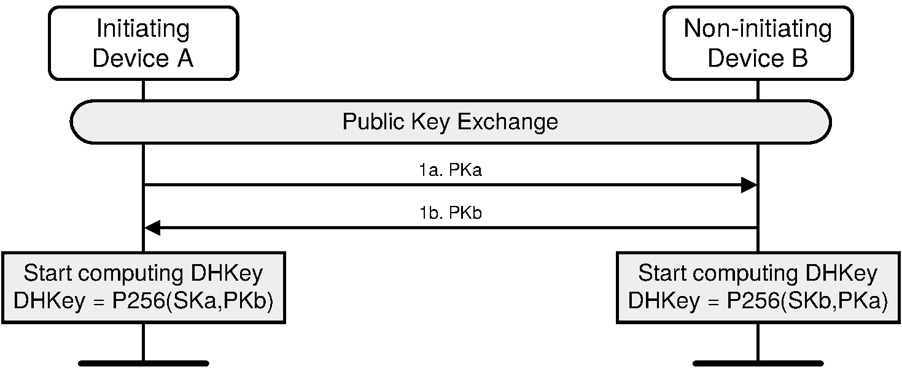
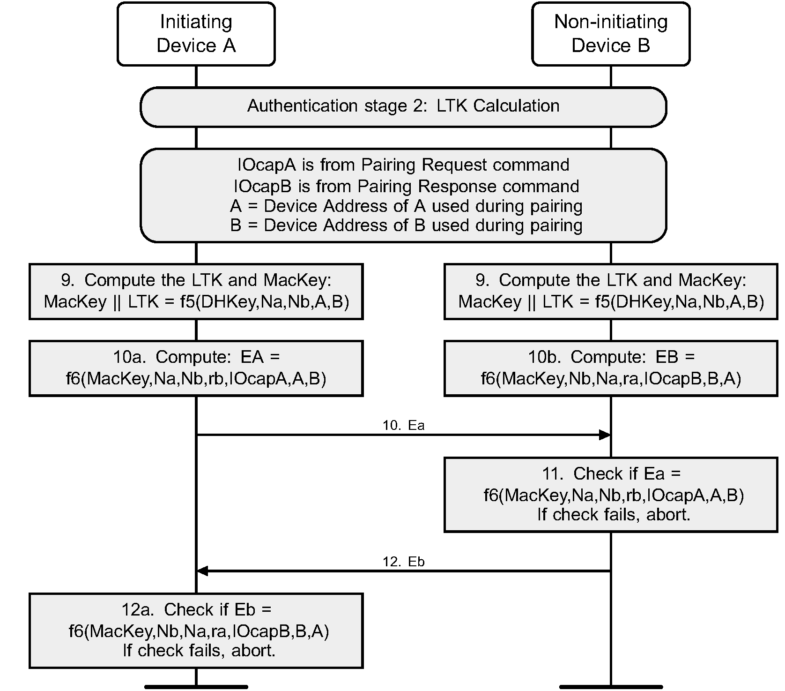

# CMPT789 Assignment 1

This assignment aims to help understand the application of cryptographic primitives in the real world by implementing the *pairing* process of Bluetooth Low Energy (BLE).
To make it easy to implement and debug, the current pairing process is implemented on top of TCP rather than Bluetooth.

There are three files (excluding this one) in this repo, *initiator.py*, *responder.py*, and *requirements.txt*.

The *initiator.py* implements the pairing logic on the *central* device side while the *responder.py* implements the pairing logic on the *peripheral* device side.
In the following of this document, *initiator* indicates the *central* device and *responder* refers to the *peripheral* device.
(For those who are not familiar with those two roles, the *central* device is usually the smartphone and the *peripheral* device is usually the low-end BLE device, e.g., a smartlock.)

The pairing process starts from the initiator device sending out a *pairing request* to the responder device, which is already implemented in the *initiator.py* file.
Your overall goal is to understand the pairing process and to fill in the blanks in *initiator.py* and *responder.py* to finish the pairing logic so the initiator and responder can successfully finish pairing, derive the shared key and session key, and successfully transmit an encrypted message.

To implement the pairing process, you may need to read the Bluetooth specification to understand how the pairing works.
The pairing process is described in [Volume 3: Host, Part H. Security Manager Specification](https://www.bluetooth.com/wp-content/uploads/Files/Specification/HTML/Core-54/out/en/host/security-manager-specification.html).

The part that you may need to pay more attention to is [2.2 Cryptographic toolbox](https://www.bluetooth.com/wp-content/uploads/Files/Specification/HTML/Core-54/out/en/host/security-manager-specification.html#UUID-b4ffdc93-6b9a-5c30-7212-8818c6adbce1) (which details how the cryptographic primitives used in BLE are implemented based on other primitives), [2.3.5. Pairing algorithms](https://www.bluetooth.com/wp-content/uploads/Files/Specification/HTML/Core-54/out/en/host/security-manager-specification.html#UUID-65a136a2-df70-4176-6125-7657b7e89301) (which describes the overall pairing procedure), and [3.5. Pairing methods](https://www.bluetooth.com/wp-content/uploads/Files/Specification/HTML/Core-54/out/en/host/security-manager-specification.html#UUID-340b59cd-6457-04d3-7e23-88d58049e454) (which describes the message format of the packets).
After you've finished the implementation, it's helpful to test your code with [Appendix D. Sample data](https://www.bluetooth.com/wp-content/uploads/Files/Specification/HTML/Core-54/out/en/host/security-manager-specification.html#UUID-aca315a3-4435-e266-b48c-a1dcf665ef4d) to check if your implementation is correct or not.


## Task 0: Environment setup

This project is implemented in python3. The code is tested with python 3.12.3. You may use other versions of python as long as it's compatible with the two dependencies in *requiremnts.txt*.

You can use the following command to install the dependencies:
```
pip pwntools==4.13.0 pycryptodome==3.20.0
```

It's recommended to use a [virtual environment](https://docs.python.org/3/library/venv.html) for this project.
You can also use [virtualenvwrapper](https://virtualenvwrapper.readthedocs.io/en/latest/) to help manage the virual environments.

## Task 1: Understand the Just Works pairing in BLE

The Just Works pairing method is used when one of the pairing devices doesn't have any IO capabilities (e.g., keyboard or touchscreen), like a headset.

This project is based on this pairing method.
So the IO capabilities of both the initiator and the responder are *NoInputNoOutput*.

There are 3 phases in pairing (as shown in the following figure):


### Phase 1: Pairing Feature Exchange

The initiator and responder first exchange their MAC addresses, followed by exchanging their pairing features.

Note that the optional step, **Security_Request**, in the previous figure is not needed in this project.
But before the initiator sends a **Pairing_Request**, the initiator should first send its MAC address and receive the responder's MAC address.

### Phase 2: (LE Secure Connections): Long Term Key (LTK) Generation

In this phase, the two devices first exchange their public key, as shown in the following figure:


Then, the two devices perform *Authentication stage 1* following this procedure:


Note that in Just Works, steps 7a and 7b can be omitted and the user doesn't need to confirm "OK".

The last stage in this phase is *Authentication stage 2*, indicated in the following figure:


Please read the specification to find all the details you need to implement.

### Phase 3: Session Key Derivation

After Phase 2, the **LTK (Long Term Key)** is derived by both devices.

Based on the LTK, a session key and session nonce are derived with the [encryption start procedure](https://www.bluetooth.com/wp-content/uploads/Files/Specification/HTML/Core-54/out/en/low-energy-controller/link-layer-specification.html#UUID-3e3b367d-caf3-acd0-4f6c-7b50ee51a6cd).

Use this formula to derive the session key:
```
session_key = AES_ECB(LTK, SKD)
```

Once the session key and session are ready, use them to encrypt a secret message based on **AES_CCM** encryption and send the message to the responder.
The responder should be able to decrypt the message.

## Task 2: Finish Cryptographic Functions

Finish the cryptographic functions defined in the Bluetooth specification.

**Please do not change *initiator.py* except finishing the f4(), f5(), and f6() functions.**

1. Finish the f4() function (denoted as *TODO1*) in *initiator.py* and *responder.py* (10 pts)

You can find its description in [2.2.6. LE Secure Connections confirm value generation function f4](https://www.bluetooth.com/wp-content/uploads/Files/Specification/HTML/Core-54/out/en/host/security-manager-specification.html#UUID-5360e21a-9043-964b-6034-50cb0183268c)


2. Finish the f5() function (denoted as *TODO2*) in *initiator.py* and *responder.py* (10 pts)

You can find its description in [2.2.7. LE Secure Connections key generation function f5](https://www.bluetooth.com/wp-content/uploads/Files/Specification/HTML/Core-54/out/en/host/security-manager-specification.html#UUID-b85fa200-af6b-577e-ca2f-853d95ef301b)

3. Finish the f6() function (denoted as *TODO3*) in *initiator.py* and *responder.py* (10 pts)

You can find its description in [2.2.8. LE Secure Connections check value generation function f6](https://www.bluetooth.com/wp-content/uploads/Files/Specification/HTML/Core-54/out/en/host/security-manager-specification.html#UUID-6f0314e8-0617-1081-394f-5598635ef23e)


It's very helpful to implement this project to read the code and specification carefully to figure out how the pairing procedure works.

## Task 3: Finish Pairing Logic

Finish the logic in *initiator.py* and *responder.py* so that the initiator and responder can successfully finish pairing and send/receive messages.

1. Finish pairing Phase 1 (denoted as *TODO4* in *initiator.py* and *responder.py* (15 pts)).

2. Finish pairing Phase 2.

    + 2.1 Finish public key exchange (denoted as *TODO5* in *initiator.py* and *responder.py* (15 pts)).

    + 2.2 Finish authentication stage 1 (denoted as *TODO6* in *initiator.py* and *responder.py* (15 pts)).

    + 2.3 Finish authentication stage 2 (denoted as *TODO7* in *initiator.py* and *responder.py* (15 pts)).

3. Finish pairing Phase 3 (denoted as *TODO8*)  in *initiator.py* and *responder.py* to decrypt the data. (10 pts)

4. (Bonus) Decrypt the encrypted message (denoted as *TODO9*) in *responder.py*. (10 pts)

## Submit Instruction

Please make sure your code can run.

Your code will be tested by first running *responder.py* and then *initiator.py*.

I will use my *initiator.py* to communicate with your *responder.py*.

Please put all your code under one folder (e.g., 'proj1') and compress the folder (e.g., using `tar czvf proj1.tgz proj1').

Please also include a `readme' file, which includes everything you want me to know, e.g., dependencies needed by your code, in the folder.

Upload your code in Canvas.